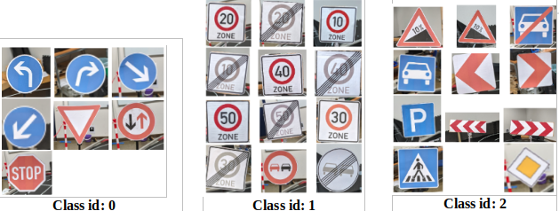
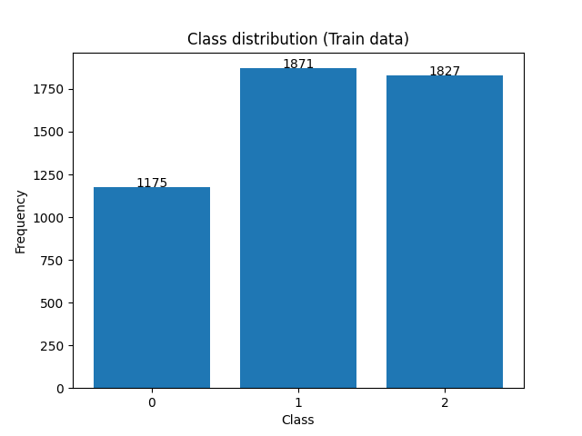
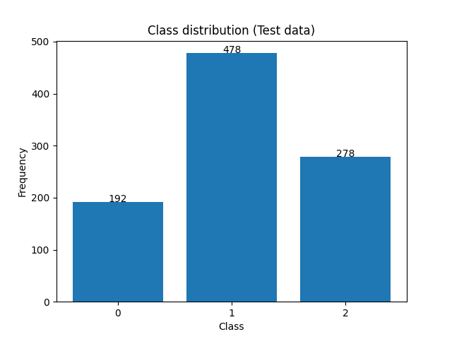

# Traffic-sign-detection-YOLOv4-tiny-
  In this Project i trained and implemented an traffic sign detector with YOLOv4-tiny for a robot car having the NVIDIA Jeston Xavier NX as board computer. Python and ROS was used for the implementation

## 1. Data and class distribution
  ### 1.1 Data: annotated in 30 classes  
  ### 1.2 Data: annotated in 3 classes
  The 30 traffic sign are grouped in to the follow 3 classes.
  

  

    
    
  

 ### 1.2 Class distribution
 ### Classifier:
     
## 2. Training
