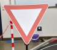
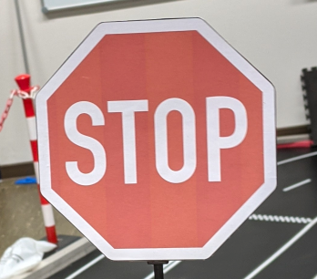

# Traffic-sign-detection-YOLOv4-tiny-
  In this Project i trained and implemented an traffic sign detector with YOLOv4-tiny for a robot car having the NVIDIA Jeston Xavier NX as board computer. Python and ROS was used for the implementation

## 1. Classes and class distribution

   

    0 
  

  

    1 
  

  

    2 
  

## 2. Training
