# Traffic-sign-detection-YOLOv4-tiny-
  In this Project i trained and implemented an traffic sign detector with YOLOv4-tiny for a robot car having the NVIDIA Jeston Xavier NX as board computer. Python and ROS was used for the implementation

## 1. Classes and class distribution
  
 0  
    1 
    2 
    3 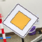
    4 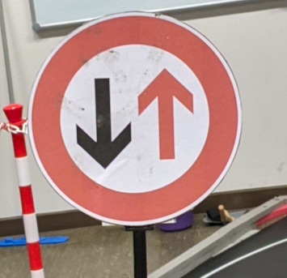
    5 
    6 
    7 
    8 
    9 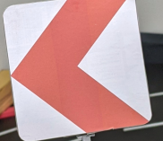  
    10 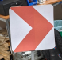
    11 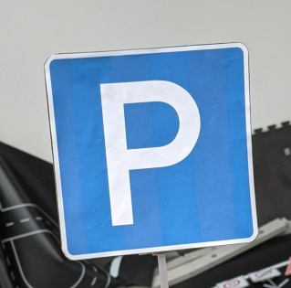
    12 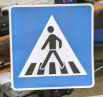
    13 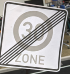
    14 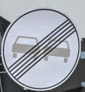
    15 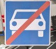
    16 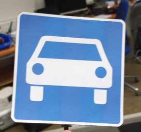
    17 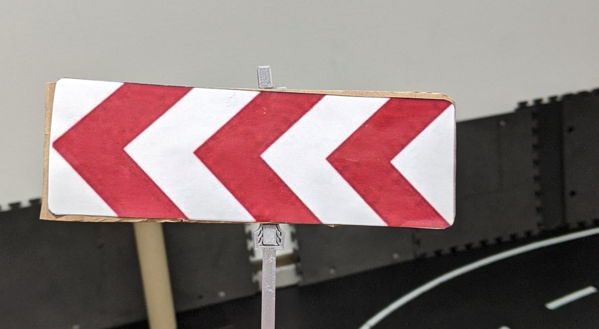
    18 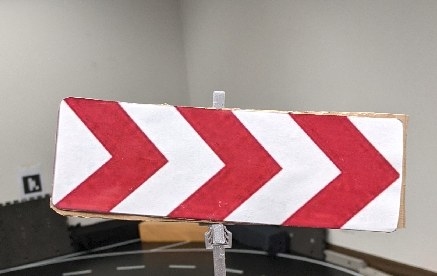  
    19 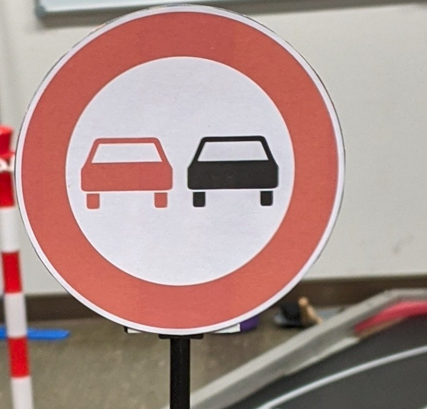 
    20 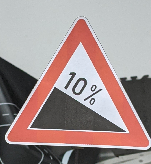
    21 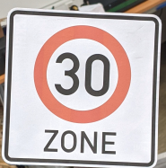
    22 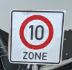 
    23 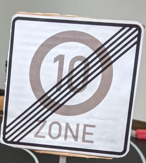
    24 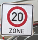
    25 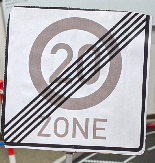
    26 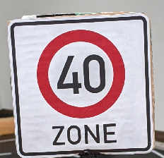  
    27 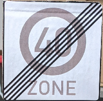
    28 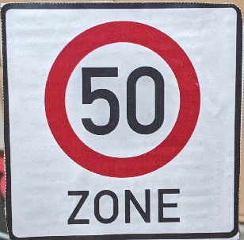
    29 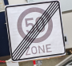

 

## 2. Training
